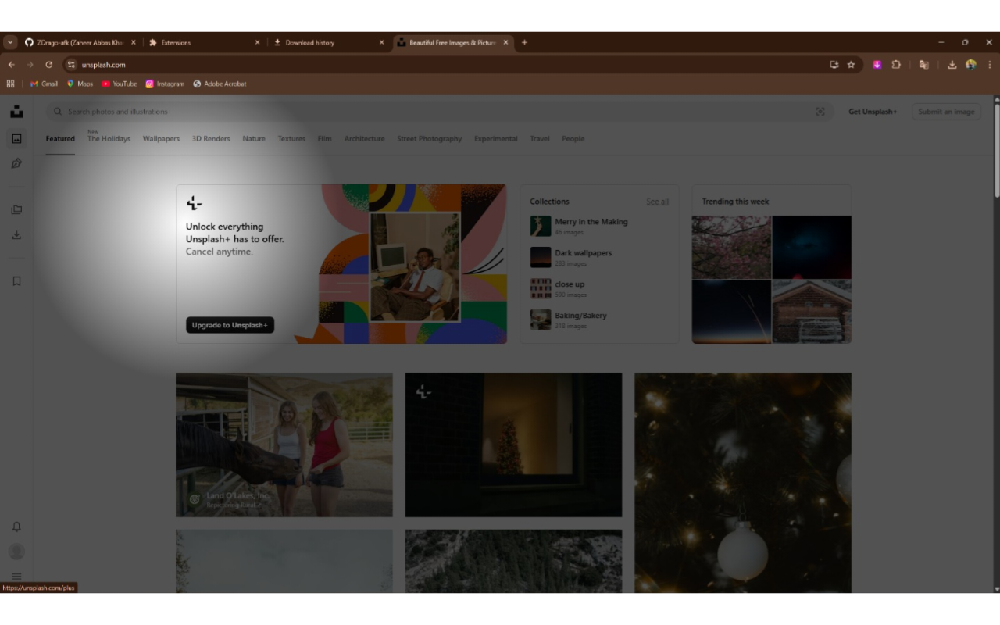
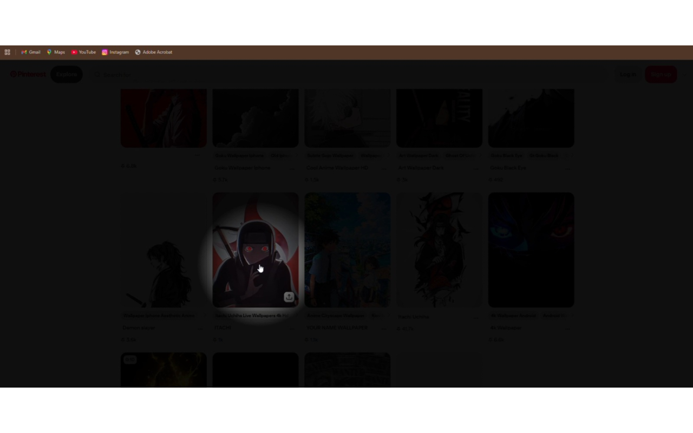
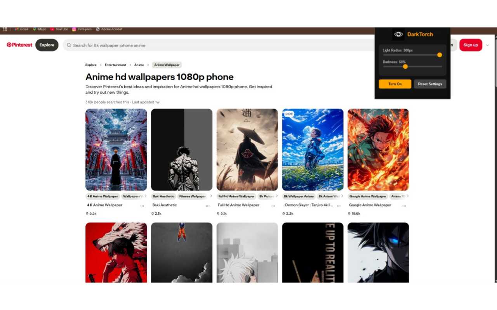

# DarkTorch 🔦

DarkTorch is a fun browser extension that darkens webpages and reveals content through a movable spotlight around the cursor.

## ✨ Features
- Full-page darkness overlay
- Cursor-based light movement
- One-click toggle
- No data collection
- Lightweight & safe

## 🚀 How to Install (Manual)
1. Open Chrome
2. Go to `chrome://extensions`
3. Enable **Developer Mode**
4. Click **Load unpacked**
5. Select the `DarkTorch` folder

## 📸 Screenshots

**Spotlight Effect-1**

**Spotlight Effect-2**

**Popup Toggle**

## 🧠 Use Case
- Fun visual experience
- Focus mode
- UI/UX experiment
- Educational browser extension project

## ⚠️ Disclaimer
This extension does not collect, track, or transmit any user data.  
It is intended for educational and fun purposes only.
